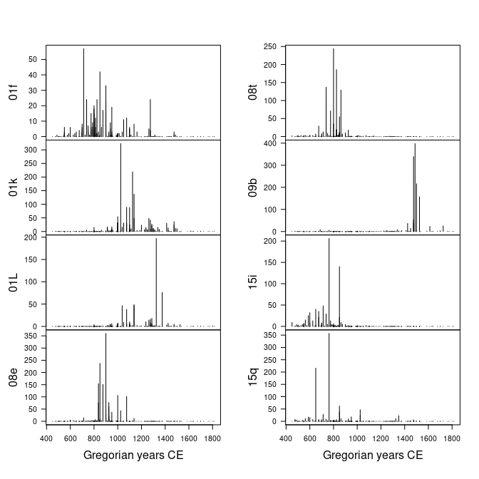
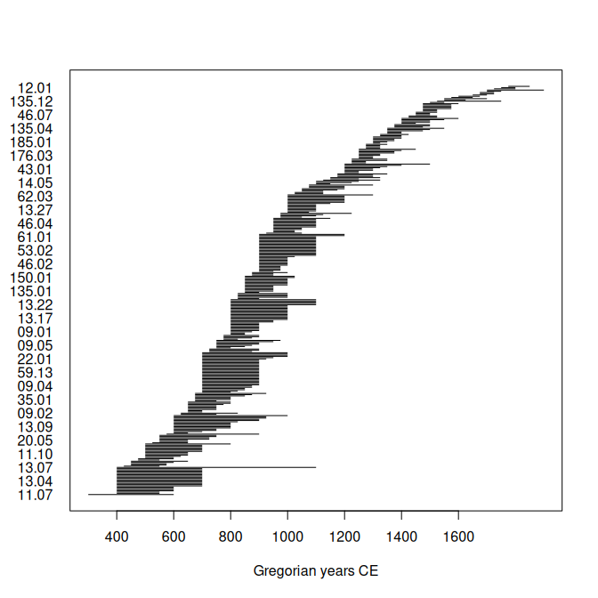

<!-- README.md is generated from README.Rmd. Please edit that file -->

# aion 

<!-- badges: start -->

<a href="https://ci.codeberg.org/repos/14685" class="pkgdown-devel"></a>
<a href="https://packages.tesselle.org/aion/coverage/"
class="pkgdown-devel"></a>
<a href="https://cran.r-project.org/package=aion"
class="pkgdown-devel"></a>

<a href="https://tesselle.r-universe.dev/aion"
class="pkgdown-devel"></a>
<a href="https://cran.r-project.org/package=aion"
class="pkgdown-release"></a>
<a href="https://cran.r-project.org/web/checks/check_results_aion.html"
class="pkgdown-release"></a>
<a href="https://cran.r-project.org/package=aion"
class="pkgdown-release"></a>

[](https://www.repostatus.org/#active)

[](https://doi.org/10.5281/zenodo.8032278)
[](https://doi.org/10.21105/joss.06210)
<!-- badges: end -->

## Overview

Base R ships with a lot of functionality useful for time series, in
particular in the **stats** package. However, these features are not
adapted to most archaeological time series. These are indeed defined for
a given calendar era, they can involve dates very far in the past and
the sampling of the observation time is (in most cases) not constant.

**aion** provides a system of classes and methods to represent and work
with such time-series (and time intervals). Dates are represented as
*rata die* (Reingold and Dershowitz 2018), i.e. the number of days since
01-01-01 (Gregorian), with negative values for earlier dates. This
allows to represent dates independently of any calendar: it makes
calculations and comparisons easier.

Once a time series is created with **aion**, any calendar can be used
for printing or plotting data (defaults to Gregorian Common Era; see
`vignette("aion")`).

**aion** does not provide tools for temporal modeling. Instead, it
offers a simple API that can be used by other specialized packages (see
[**kairos**](https://packages.tesselle.org/kairos/) or
[**ananke**](https://packages.tesselle.org/ananke/)).

------------------------------------------------------------------------

To cite aion in publications use:

Frerebeau N (2024). “aion: An R Package to Represent Archaeological Time
Series.” *Journal of Open Source Software*, *9*(96), 6210.
<doi:10.21105/joss.06210> <https://doi.org/10.21105/joss.06210>.

Frerebeau N, Roe J (2025). *aion: Archaeological Time Series*.
Université Bordeaux Montaigne, Pessac, France.
<doi:10.5281/zenodo.8032278> <https://doi.org/10.5281/zenodo.8032278>, R
package version 1.5.0, <https://packages.tesselle.org/aion/>.

This package is a part of the tesselle project
<https://www.tesselle.org>.

## Installation

You can install the released version of **aion** from
[CRAN](https://CRAN.R-project.org) with:

``` r
install.packages("aion")
```

And the development version from [Codeberg](https://codeberg.org/) with:

``` r
# install.packages("remotes")
remotes::install_git("https://codeberg.org/tesselle/aion")
```

## Usage

``` r
## Load package
library(aion)
```

Time-series of ceramic counts:

``` r
## Get ceramic counts (data from Husi 2022)
data("loire", package = "folio")

## Keep only variables whose total is at least 600
keep <- c("01f", "01k", "01L", "08e", "08t", "09b", "15i", "15q")

## Get time midpoints
mid <- rowMeans(loire[, c("lower", "upper")])

## Create time-series
X <- series(
  object = loire[, keep],
  time = mid,
  calendar = AD()
)

## Plot (default calendar)
plot(
  x = X, 
  type = "h" # histogram like vertical lines
)
```

<!-- -->

Plot time ranges:

``` r
## Create time intervals
Y <- intervals(
  start = loire$lower,
  end = loire$upper,
  names = rownames(loire),
  calendar = AD()
)

## Plot (default calendar)
plot(x = Y)
```

<!-- -->

## Translation

This package provides translations of user-facing communications, like
messages, warnings and errors, and graphical elements (axis labels). The
preferred language is by default taken from the locale. This can be
overridden by setting of the environment variable `LANGUAGE` (you only
need to do this once per session):

``` r
Sys.setenv(LANGUAGE = "<language code>")
```

Languages currently available are English (`en`) and French (`fr`).

## Related Works

- [**era**](https://cran.r-project.org/package=era) provides a
  consistent representation of year-based time scales as a numeric
  vector with an associated era.

## Contributing

Please note that the **aion** project is released with a [Contributor
Code of Conduct](https://www.tesselle.org/conduct.html). By contributing
to this project, you agree to abide by its terms.

## References

<div id="refs" class="references csl-bib-body hanging-indent"
entry-spacing="0">

<div id="ref-allen1983" class="csl-entry">

Allen, James F. 1983. “Maintaining Knowledge about Temporal Intervals.”
*Communications of the ACM* 26 (11): 832–43.
<https://doi.org/10.1145/182.358434>.

</div>

<div id="ref-alspaugh2019" class="csl-entry">

Alspaugh, Thomas. 2019. “Allen’s Interval Algebra.” 2019.
<https://thomasalspaugh.org/pub/fnd/allen.html>.

</div>

<div id="ref-frerebeau2024" class="csl-entry">

Frerebeau, Nicolas. 2024. “<span class="nocase">aion</span>: An R
Package to Represent Archaeological Time Series.” *Journal of Open
Source Software* 9 (96): 6210. <https://doi.org/10.21105/joss.06210>.

</div>

<div id="ref-reingold2018" class="csl-entry">

Reingold, Edward M., and Nachum Dershowitz. 2018. *Calendrical
Calculations: The Ultimate Edition*. 4th ed. Cambridge University Press.
<https://doi.org/10.1017/9781107415058>.

</div>

</div>
