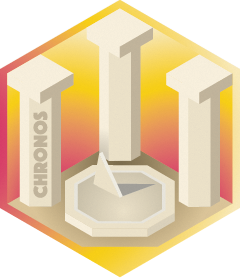

<!-- README.md is generated from README.Rmd. Please edit that file -->

# chronos 

<!-- badges: start -->

[](https://github.com/tesselle/chronos/actions)
[](https://codecov.io/gh/tesselle/chronos)
[](https://www.codefactor.io/repository/github/tesselle/chronos/overview/main)

<a href="https://tesselle.r-universe.dev" class="pkgdown-devel"></a>

[](https://www.repostatus.org/#wip)
<!-- badges: end -->

## Overview

Base R ships with a lot of functionality useful for time series, in
particular in the **stats** package: a time-series object can be created
with the `stats::ts()` function. These objects are agnostic: the unit of
time is not relevant, only the sampling frequency matters. Most of the
archaeological time-series are different, because they are defined for a
given year-based time scale (in the same way that geographic data are
linked to a coordinate system).

**chronos** provides a system of classes and methods to represent and
work with such time-series. This package includes common time scales
(e.g., before present, common era) and supports user-defined scales.
Time-series can be reprojected to a different time scale (e.g. from BP
to CE years). **chronos** only supports data expressed in decimal years
(1950 means 1950.0, i.e. the beginning of the year 1950).

## Installation

You can install the released version of **chronos** from
[CRAN](https://CRAN.R-project.org) with:

``` r
install.packages("chronos")
```

And the development version from [GitHub](https://github.com/) with:

``` r
# install.packages("remotes")
remotes::install_github("tesselle/chronos")
```

## Usage

``` r
## Load package
library(chronos)
```

``` r
## Create 6 time-series of 50 observations
## Sampled every two years starting from 2000 BP
X <- series(
  object = matrix(rnorm(300), nrow = 50, ncol = 6),
  time = seq(from = 2000, by = 2, length.out = 50),
  calendar = era("BP")
)

## Reproject to the CE time scale
(Y <- project(X, era("CE")))

## Plot
plot(Y)
```

## Contributing

Please note that the **chronos** project is released with a [Contributor
Code of Conduct](https://www.tesselle.org/conduct.html). By contributing
to this project, you agree to abide by its terms.
